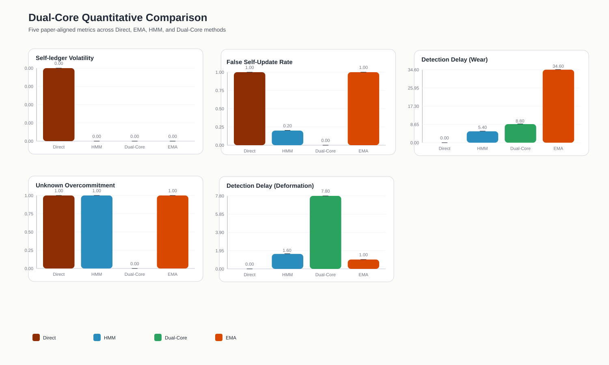
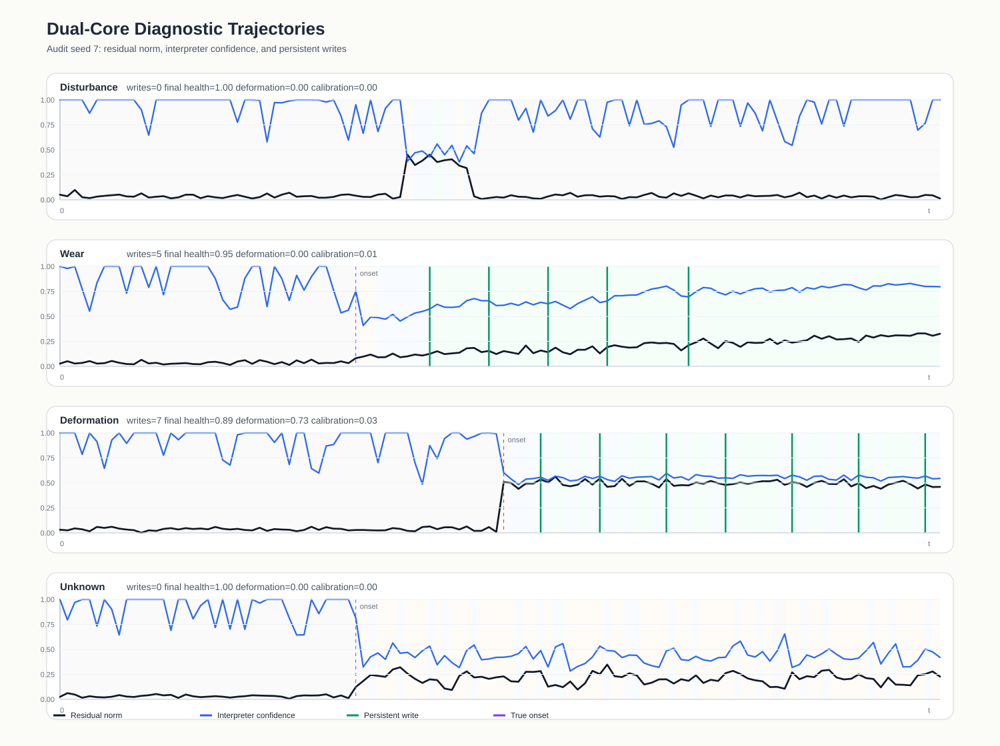
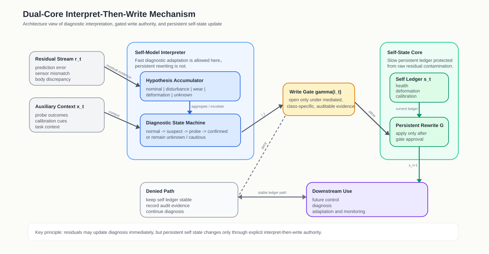

# Figure Captions

## Figure 1. Quantitative Comparison Across Update Mechanisms

Comparison of the four evaluated update mechanisms across the five paper-aligned metrics: self-ledger volatility under nominal operation, false self-update rate under disturbance, detection delay under wear, detection delay under deformation, and unknown-condition overcommitment. The proposed Dual-Core mechanism achieves zero false self-updates under disturbance and zero unknown-condition overcommitment in the current prototype, while preserving finite detection delay under both gradual wear and abrupt deformation. In contrast, the Direct and EMA baselines remain highly prone to over-writing persistent self state under disturbance and unknown conditions, whereas the HMM updater reacts faster but remains less conservative under uncertainty.

Current run highlights:

- Dual-Core disturbance false-update rate: 0.0000 +/- 0.0000
- Dual-Core unknown overcommitment: 0.0000 +/- 0.0000
- Dual-Core wear delay: 8.8000 +/- 2.3152
- Dual-Core deformation delay: 7.8000 +/- 2.6382
- HMM wear / deformation delay: 5.4000 +/- 1.0198 / 1.6000 +/- 0.4899
- Direct disturbance false-update rate: 1.0000 +/- 0.0000
- EMA unknown overcommitment: 1.0000 +/- 0.0000

## Figure 2. Representative Dual-Core Diagnostic Trajectories

Representative audit trajectories for the proposed Dual-Core mechanism using seed 7. Each panel shows residual magnitude, interpreter confidence, ground-truth onset, and the timing of persistent self-ledger writes for one operating regime. The disturbance panel illustrates that transient mismatch can elevate interpreter activity without forcing persistent self rewriting. The wear and deformation panels show the intended interpret-then-write ordering: residual evidence first accumulates, interpreter confidence rises, and only then does the gate authorize a persistent update. The unknown panel illustrates the conservative target behavior in which discrepancy may remain diagnostically active without immediate commitment to a known self-change class.

## Figure 3. Dual-Core Interpret-Then-Write Architecture

Architecture diagram of the proposed Dual-Core mechanism. Residual evidence and auxiliary context are first processed by the Self-Model Interpreter, which maintains hypothesis scores and a diagnostic state machine. A class-specific write gate then decides whether diagnostic evidence has become strong enough to authorize persistent self rewriting. If the gate remains closed, the system records the discrepancy in the audit path while keeping the self ledger stable. If the gate opens, the Self-State Core applies a conservative persistent rewrite. This diagram visualizes the paper's central architectural claim: diagnosis may change quickly, but persistent self state should change only through explicit mediated write authority.
